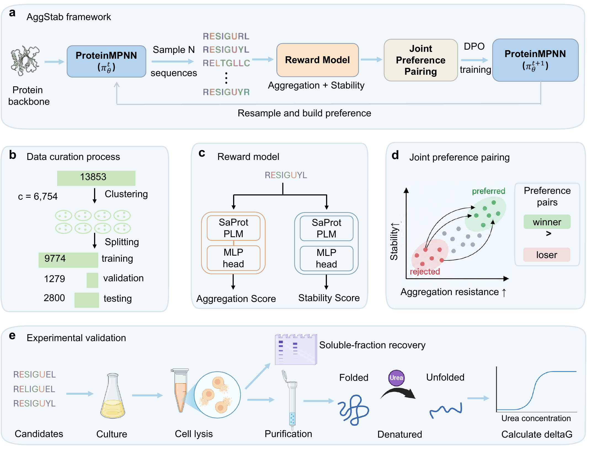

# AggStab: Preference-aligned inverse folding for joint optimization of aggregation resistance and folding stability


AggStab is a fixed-backbone protein inverse-folding framework that aligns
ProteinMPNN to two experimentally grounded objectives: resistance to
stress-induced aggregation and folding stability. Frozen, backbone-conditioned
SaProt reward models score sampled sequences, joint winner-loser preferences
align the generator through direct preference optimization (DPO), and the
updated policy resamples candidates in a semi-online training loop.



The public release is inference-first. Its primary workflows are:

- backbone-conditioned aggregation-resistance prediction;
- backbone-conditioned folding-stability prediction on the learned
  $\Delta G_{\mathrm{unfolding}}$ scale;
- generation and joint reranking of aggregation-resistant, stable sequences.

Training and evaluation pipelines are retained for reproducibility, but most
users only need the pretrained checkpoints and the commands in
[Quick start](#quick-start-pretrained-inference).

This repository accompanies the manuscript:

> **AggStab: Preference-aligned inverse folding for joint optimization of
> aggregation resistance and folding stability**

The manuscript is being prepared for submission. Citation information will be
added when it becomes publicly available. Trained checkpoints will be provided
as a versioned external release because the full reward-model files are too
large for the Git repository.

## Method overview

For every target backbone, AggStab performs the following semi-online loop:

1. Sample candidate sequences from the current ProteinMPNN policy.
2. Score candidates with frozen aggregation-resistance and stability predictors.
3. Apply a wild-type-relative stability gate.
4. Construct preference pairs for which the winner improves both reward axes.
5. Optimize DPO plus winner-sequence negative log-likelihood.
6. Resample from the updated policy and rebuild preferences for the next round.

The main paper setting uses two rounds, disjoint training halves, one epoch per
round, 16 samples per backbone, sampling temperature 0.5, DPO beta 0.1, and an
SFT loss weight of 1.0.

## Quick start: pretrained inference

Most users do not need to retrain AggStab. The three primary inference tasks
are backbone-conditioned aggregation-resistance prediction, folding-stability
prediction, and sequence design. All commands below accept a single-chain PDB
backbone and use Foldseek to derive its 3Di structural context.

### Download the pretrained models

Download the versioned model archive and place the files as follows:

```text
checkpoints/
  aggregation_reward.ckpt
  stability_reward.ckpt
  aggstab_policy.pt
```

The public download URL and SHA256 manifest will be added here with the first
model release. Model archives are kept outside the Git repository because the
two full Lightning reward checkpoints are approximately 2.65 GB each. The
small `aggstab_policy.pt` file contains the aligned ProteinMPNN policy. Exact
file sizes and checksums are recorded in
[`models/model_manifest.yaml`](models/model_manifest.yaml).

Set the external model and executable locations:

```bash
export SAPROT_MODEL_PATH=/absolute/path/to/SaProt_650M_PDB
export PROTEINMPNN_DIR=/absolute/path/to/ProteinMPNN
export PROTEINMPNN_CKPT="$PROTEINMPNN_DIR/vanilla_model_weights/v_48_020.pt"
export FOLDSEEK_BIN=/absolute/path/to/foldseek
```

The query sequence must have the same length as the selected PDB chain. The
current public interface supports single-chain fixed-backbone inference.
For an AlphaFold PDB whose B-factor field contains pLDDT, add
`--mask_low_confidence` to reproduce the low-confidence 3Di masking used during
data preparation. Do not use this option for experimental B-factors.

### Predict aggregation resistance

Score the sequence encoded by the input PDB:

```bash
python scripts/predict_properties.py \
  --pdb examples/target.pdb \
  --chain A \
  --aggregation_ckpt checkpoints/aggregation_reward.ckpt \
  --output_csv outputs/target_aggregation.csv \
  --device cuda:0
```

Score a proposed sequence on the same fixed backbone by adding
`--sequence SEQUENCE`. For multiple sequences, use `--fasta candidates.fasta`.
The output column `aggregation_resistance_score` is on the learned experimental
phenotype scale; larger values indicate stronger predicted resistance to
stress-induced aggregation. `aggregation_gain_vs_wt` subtracts the score of
the PDB-encoded sequence.

### Predict folding stability (Delta G)

```bash
python scripts/predict_properties.py \
  --pdb examples/target.pdb \
  --chain A \
  --fasta candidates.fasta \
  --stability_ckpt checkpoints/stability_reward.ckpt \
  --output_csv outputs/target_stability.csv \
  --device cuda:0
```

The output column `predicted_deltaG` is the model-predicted unfolding free
energy on the training-assay scale; larger values indicate stronger predicted
folding stability. `stability_gain_vs_wt` is the design prediction minus the
prediction for the PDB-encoded sequence. These values are computational
predictions and should not be interpreted as direct experimental measurements.

Both properties can be evaluated in one run by supplying both checkpoints:

```bash
python scripts/predict_properties.py \
  --pdb examples/target.pdb \
  --fasta candidates.fasta \
  --aggregation_ckpt checkpoints/aggregation_reward.ckpt \
  --stability_ckpt checkpoints/stability_reward.ckpt \
  --output_csv outputs/target_properties.csv \
  --device cuda:0
```

### Design aggregation-resistant and stable sequences

Generate 48 sequences from the released AggStab policy, score them with both
reward models, apply the staged quality filters used in the paper, and retain
the top three:

```bash
python scripts/design_with_aggstab.py \
  --pdb examples/target.pdb \
  --chain A \
  --policy_ckpt checkpoints/aggstab_policy.pt \
  --aggregation_ckpt checkpoints/aggregation_reward.ckpt \
  --stability_ckpt checkpoints/stability_reward.ckpt \
  --num_samples 48 \
  --temperature 0.5 \
  --top_k 3 \
  --output_dir outputs/target_design \
  --device cuda:0
```

This creates:

```text
outputs/target_design/
  all_candidates.csv
  top3_candidates.csv
  top3_candidates.fasta
  run_config.json
```

For a previously unseen backbone, both WT-relative columns use predictions for
the PDB-encoded sequence as their reference. Structural prediction and
experimental validation remain recommended before synthesis.

## Repository layout

```text
configs/                         Final and exploratory reward-model configs
datasets/                        Reward-model dataset loaders
src/models/                      SaProt-based reward architectures
src/ln/                          PyTorch Lightning reward training/evaluation
src/mpnn/                        ProteinMPNN loading, sampling, and likelihoods
src/dpo/                         Pair construction and DPO/SFT trainers
scripts/                         End-to-end pipelines and evaluation utilities
```

The primary implementation files are:

```text
configs/proagg_final_candidate.yaml              Aggregation reward config
configs/proagg_deltaG_only.yaml                  Stability reward config
src/dpo/sample_and_score_joint.py                Joint preference construction
src/dpo/dpo_sft_train.py                         DPO + winner regularization
scripts/run_dpo_sft_joint_semi_online_pipeline.sh Main AggStab pipeline
scripts/run_dpo_aggonly_semi_online_pipeline.sh    Aggregation-only controls
scripts/run_dpo_stabonly_semi_online_pipeline.sh   Stability-only controls
scripts/export_dpo_test_candidates.py            Full candidate export
scripts/select_joint_topk_candidates.py          Staged joint top-k selection
scripts/run_chai_batch_from_candidates_resume.py  Sharded Chai-1 evaluation
scripts/analyze_joint_structure_vs_wt.py          Structure-aware summary
```

## Installation

Clone AggStab and create the main training environment:

```bash
git clone https://github.com/xtanh/protein_aggregation.git
cd protein_aggregation
conda env create -f environment.yml
conda activate aggstab
```

AggStab uses the official [ProteinMPNN](https://github.com/dauparas/ProteinMPNN)
implementation. Clone it separately and expose its location:

```bash
git clone https://github.com/dauparas/ProteinMPNN.git third_party/ProteinMPNN
export PROTEINMPNN_DIR="$PWD/third_party/ProteinMPNN"
export PROTEINMPNN_CKPT="$PROTEINMPNN_DIR/vanilla_model_weights/v_48_020.pt"
```

Download `SaProt_650M_PDB` using the official
[SaProt repository](https://github.com/westlake-repl/Saprot), then set:

```bash
export SAPROT_MODEL_PATH=/absolute/path/to/SaProt_650M_PDB
```

The two required variables can be made persistent in the shell configuration.
The code also recognizes a sibling `../ProteinMPNN` checkout when
`PROTEINMPNN_DIR` is not set.

Chai-1 structure prediction is best installed in a separate environment because
its dependency stack differs from the reward-training environment. Follow the
official [chai-lab installation](https://github.com/chaidiscovery/chai-lab).

Foldseek must also be installed for arbitrary-backbone inference. Set
`FOLDSEEK_BIN` if its executable is not available on `PATH`.

## Data and checkpoints

Large datasets, structures, model weights, generated candidates, and molecular
dynamics trajectories are intentionally excluded from Git. The expected local
layout is:

```text
data/
  rocklin/
    train.csv
    valid.csv
    test.csv
    Metagenomic_dG.csv
    rawdata/data.csv
  dpo/
    representative_pdbs/
      train/*.pdb
      valid/*.pdb
      test/*.pdb
    subsets/threshold_balance_ltneg1_eq/
      train/*.pdb
      valid/*.pdb

checkpoints/
  aggregation_reward.ckpt
  stability_reward.ckpt
```

Reward-model split CSVs require at least these columns:

```text
name
protein_sequence
sa_sequence_foldseek
log2_fold_change_75_clip
```

`Metagenomic_dG.csv` requires `name`, `deltaG`, and `deltaG_95CI`.
`rawdata/data.csv` supplies the protein-name to structural-token lookup used
during candidate scoring. Structural tokens can be generated from backbone
structures with Foldseek following the SaProt data-preparation protocol.

Set a non-default processed-data root if needed:

```bash
export AGGSTAB_DATA_DIR=/absolute/path/to/rocklin
```

## Optional: train the reward models

Train the aggregation-resistance and stability predictors independently:

```bash
python src/ln/lightning_train.py \
  --config configs/proagg_final_candidate.yaml

python src/ln/lightning_train.py \
  --config configs/proagg_deltaG_only.yaml
```

Both commands write PyTorch Lightning runs beneath `results/lightning_logs/`.
The paper models use SaProt-650M with LoRA on query, key, and value projections.

## Optional: reproduce AggStab training

The following command reproduces the main two-round training protocol after the
processed data and reward checkpoints have been placed as above:

```bash
export AGG_CKPT="$PWD/checkpoints/aggregation_reward.ckpt"
export STAB_CKPT="$PWD/checkpoints/stability_reward.ckpt"

CUDA_VISIBLE_DEVICES=0 \
PDB_TRAIN=data/dpo/subsets/threshold_balance_ltneg1_eq/train \
PDB_VALID=data/dpo/subsets/threshold_balance_ltneg1_eq/valid \
PDB_TEST=data/dpo/representative_pdbs/test \
SELECT_PDB_VALID=data/dpo/subsets/threshold_balance_ltneg1_eq/valid \
MAX_TRAIN_PDBS=-1 \
MAX_VALID_PDBS=366 \
MAX_TEST_PDBS=1350 \
SELECT_MAX_VALID_PDBS=366 \
NUM_SAMPLES=16 \
TEMPERATURE=0.5 \
SEED=42 \
ROUNDS=2 \
ROUND_EPOCHS=1 \
ROUND_TRAIN_SPLIT_MODE=halves \
ROUND_TRAIN_SPLIT_SEED=42 \
DPO_BETA=0.1 \
DPO_SFT_LOSS_WEIGHT=1.0 \
DPO_BATCH_SIZE=32 \
DPO_PATIENCE=1 \
AGG_SCORE_GAP_DELTA=0.20 \
STAB_SCORE_GAP_DELTA=0.20 \
STABILITY_GATE_MODE=wt_absolute \
STABILITY_GATE_MARGIN=0.5 \
VALID_SELECTION_ENABLED=1 \
VALID_SELECTION_METRIC=joint_sum \
VALID_SELECTION_MAX_PENALTY=0.1 \
RUN_TAG=aggstab_r2 \
OUTPUT_ROOT=results/aggstab_r2 \
bash scripts/run_dpo_sft_joint_semi_online_pipeline.sh \
  "$AGG_CKPT" "$STAB_CKPT" cuda:0
```

Round directories are zero-indexed. For this two-round run, the final policy is
normally written to:

```text
results/aggstab_r2/round1/dpo_sft/mpnn_dpo_epoch1.pt
```

The validation-selection JSON records the exact checkpoint advanced between
rounds. Test-set results are not used for checkpoint selection.

## Objective and regularization controls

The aggregation-only and stability-only pipelines use the same semi-online
outer loop. `DPO_SFT_LOSS_WEIGHT=0` runs pure DPO,
`DPO_SFT_LOSS_WEIGHT=1` runs DPO plus winner regularization, and `SFT_ONLY=1`
runs winner-only SFT:

```bash
# Aggregation-only DPO + winner regularization
DPO_SFT_LOSS_WEIGHT=1.0 \
ROUND_TRAIN_SPLIT_MODE=halves \
bash scripts/run_dpo_aggonly_semi_online_pipeline.sh \
  "$AGG_CKPT" "$STAB_CKPT" cuda:0

# Stability-only DPO + winner regularization
DPO_SFT_LOSS_WEIGHT=1.0 \
ROUND_TRAIN_SPLIT_MODE=halves \
bash scripts/run_dpo_stabonly_semi_online_pipeline.sh \
  "$AGG_CKPT" "$STAB_CKPT" cuda:0
```

Set the remaining dataset sizes, seeds, and output variables exactly as in the
main command when reproducing matched controls.

## Export and rerank candidates

Export 16 candidates per test backbone from the final policy:

```bash
python scripts/export_dpo_test_candidates.py \
  --pdb_dir data/dpo/representative_pdbs/test \
  --mpnn_ckpt results/aggstab_r2/round1/dpo_sft/mpnn_dpo_epoch1.pt \
  --proagg_ckpt "$AGG_CKPT" \
  --proagg_config configs/proagg_final_candidate.yaml \
  --stab_ckpt "$STAB_CKPT" \
  --stab_config configs/proagg_deltaG_only.yaml \
  --stability_csv data/rocklin/Metagenomic_dG.csv \
  --output_csv results/aggstab_r2/fulltest_candidates.csv \
  --num_samples 16 \
  --temperature 0.5 \
  --proagg_batch_size 16 \
  --mpnn_logprob_batch_size 16 \
  --device cuda:0 \
  --seed 42
```

Apply the staged joint reranker and retain three candidates per backbone:

```bash
python scripts/select_joint_topk_candidates.py \
  --input_csv results/aggstab_r2/fulltest_candidates.csv \
  --output_csv results/aggstab_r2/top3_joint_candidates.csv \
  --output_fasta results/aggstab_r2/top3_joint_candidates.fasta \
  --tag AggStab \
  --top_k 3
```

The first filtering stage containing at least three candidates supplies all
three retained sequences; candidates are not accumulated across stages.

## Chai-1 structure prediction

Run the retained candidates in four independent shards. Activate the Chai-1
environment before launching these processes.

```bash
for shard in 0 1 2 3; do
  CUDA_VISIBLE_DEVICES="$shard" python \
    scripts/run_chai_batch_from_candidates_resume.py \
    --input_csv results/aggstab_r2/top3_joint_candidates.csv \
    --output_dir results/aggstab_r2/chai_top3_joint \
    --device cuda:0 \
    --num_shards 4 \
    --shard_idx "$shard" \
    > "results/aggstab_r2/chai_shard${shard}.log" 2>&1 &
done
wait
```

The default settings use three trunk recycles, 200 diffusion steps, seed 42,
ESM embeddings, and select the highest-pLDDT structure from the Chai-1 samples.

## Reproducibility notes

- All main sampling and training runs use seed 42.
- Candidate sequences are deduplicated while preserving sample order.
- The aggregation and stability predictors remain frozen during preference optimization.
- Validation candidates are used only for checkpoint evaluation, not gradient updates.
- `results/`, `data/`, checkpoints, figures, logs, and trajectories are ignored by Git.
- The repository contains research code and assumes single-chain fixed-backbone inputs.

## Acknowledgements

AggStab builds on
[ProteinMPNN](https://github.com/dauparas/ProteinMPNN),
[SaProt](https://github.com/westlake-repl/Saprot), Foldseek, and
[Chai-1](https://github.com/chaidiscovery/chai-lab). Please cite the original
methods and comply with their respective licenses when using those components.

## License

No license has yet been assigned to the original AggStab code. Until a license
is added, please contact the authors for permission to reuse or redistribute it.

## Citation

Citation information will be added after the manuscript is publicly available.
